# Experiments

All numbers are produced by the scripts in `tools/` from the provided recordings. **The only recording with real
obstacles (`doubleT_obstacle`) was held out**: it was never used to design or tune anything. Tuning used only
false-positive analysis on the five obstacle-free recordings and ray-cast synthetic obstacles inside them.

Hardware of these measurements: laptop Intel i5-8250U (15 W, 4 cores), single thread (numpy + numba kernels). The evaluation stand
(i7-9700E, 65 W) is expected to be faster.

## 1. False alarms on all obstacle-free recordings (every frame, 2287 frames)

| Recording | Frames | False STOP frames | CAUTION frames | Median latency, ms |
|---|---|---|---|---|
| roundT→doubleT | 252 | 0 (0.0 %) | 104 | 74 |
| squareT platform + switch | 877 | 2 (0.2 %) | 582 | 63 |
| doubleT platform | 345 | 1 (0.3 %) | 169 | 78 |
| roundT/squareT pressure gate | 545 | 0 (0.0 %) | 102 | 71 |
| roundT pressure gate | 268 | 0 (0.0 %) | 49 | 66 |
| **Total** | **2287** | **3 (0.13 %)** | 1006 | 69 |

Distinct false STOP tracks: 2. Median verified clear distance: 174 m.

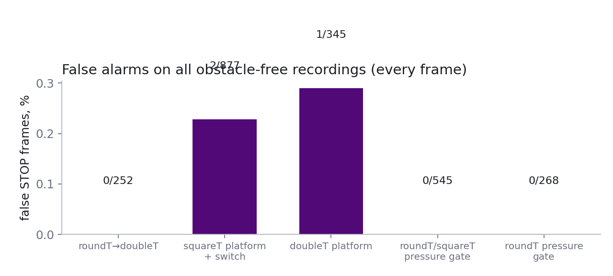

## 2. Held-out real obstacle recording (`doubleT_obstacle`, stationary train, people in the tunnel)

Reference positions of the people come from an independent method (per-pixel median background subtraction of the
stationary recording), not from the detector.

* Frames in which person A was inside the train envelope: **60**
* ... detected: **60**, confirmed STOP: **59** (detection distance ≈ 55.7 m)
* Person B walking beside the train, outside the envelope: never raised STOP (correct).
* STOP detections not corresponding to a person: **0**
* Median processing time (921 600-point clouds): 89 ms

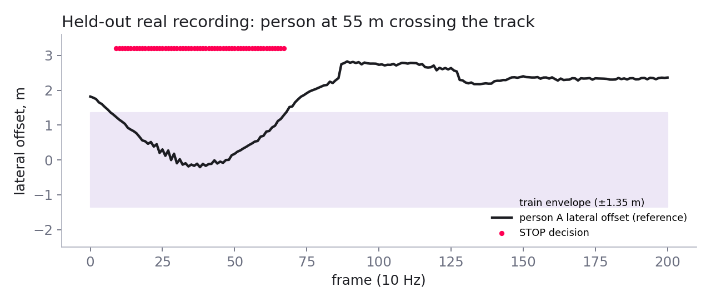

## 3. Detection range: ray-cast obstacles in real frames

Obstacles are ray-cast into the sensor's actual beam directions (occlusion and angular sampling of the real Pandar128),
with returns lost at long range according to the Pandar128E3X link budget (200 m at 10 % reflectivity). Each case:
start distance D0, approach at 10 m/s over 12 real consecutive frames, 3 start positions in each of the 5 empty
recordings. Recall is computed over cases where the object is physically visible (≥ 3 returns; in curves objects
beyond the sight distance are occluded by the tunnel wall and no sensor can see them).

| Object | D0, m | cases | visible | recall | frames to confirm | returns at D0 |
|---|---|---|---|---|---|---|
| person 1.75 m (ρ 15%) | 40 | 15 | 15 | 1.00 | 2.0 | 285.1 |
| person 1.75 m (ρ 15%) | 80 | 15 | 15 | 1.00 | 2.4 | 67.8 |
| person 1.75 m (ρ 15%) | 120 | 15 | 13 | 0.77 | 2.6 | 23.1 |
| person 1.75 m (ρ 15%) | 160 | 15 | 10 | 0.30 | 8.3 | 9.3 |
| person 1.75 m (ρ 15%) | 200 | 15 | 5 | 0.00 | nan | 1.4 |
| box 0.5 m (ρ 20%) | 40 | 15 | 15 | 1.00 | 2.0 | 83.7 |
| box 0.5 m (ρ 20%) | 80 | 15 | 15 | 0.93 | 1.9 | 20.9 |
| box 0.5 m (ρ 20%) | 120 | 15 | 10 | 0.70 | 2.7 | 6.7 |
| box 0.5 m (ρ 20%) | 160 | 15 | 6 | 0.00 | nan | 2.5 |
| box 0.5 m (ρ 20%) | 200 | 15 | 1 | 0.00 | nan | 0.5 |
| dark box 0.5 m (ρ 5%) | 40 | 15 | 15 | 1.00 | 2.0 | 83.7 |
| dark box 0.5 m (ρ 5%) | 80 | 15 | 15 | 0.93 | 1.9 | 20.9 |
| dark box 0.5 m (ρ 5%) | 120 | 15 | 9 | 0.67 | 4.0 | 2.9 |
| dark box 0.5 m (ρ 5%) | 160 | 15 | 0 | nan | nan | 0.0 |
| dark box 0.5 m (ρ 5%) | 200 | 15 | 0 | nan | nan | 0.0 |
| box 0.3 m (ρ 20%) | 40 | 15 | 15 | 1.00 | 2.3 | 29.3 |
| box 0.3 m (ρ 20%) | 80 | 15 | 14 | 0.29 | 7.0 | 7.6 |
| box 0.3 m (ρ 20%) | 120 | 15 | 7 | 0.00 | nan | 2.5 |
| box 0.3 m (ρ 20%) | 160 | 15 | 0 | nan | nan | 0.5 |
| box 0.3 m (ρ 20%) | 200 | 15 | 0 | nan | nan | 0.0 |

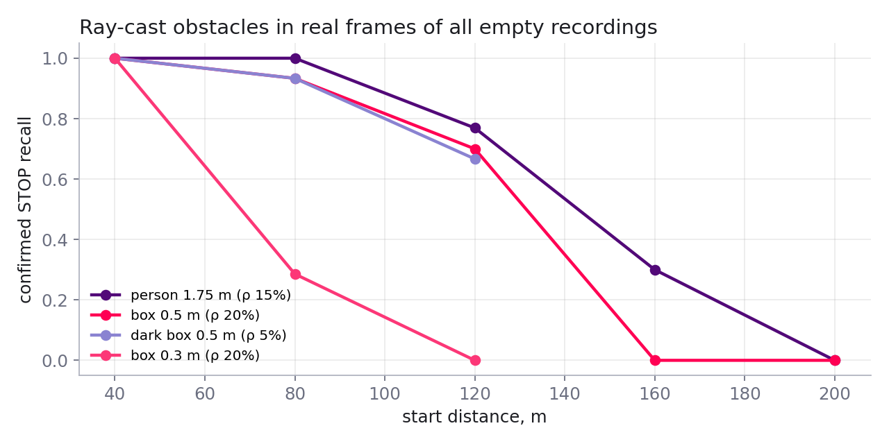

Note: the scorer's training positives come from the same ray-cast generator (different random draws), so the gain of
the hybrid in this table over the rules is optimistic; the leave-one-recording-out numbers in section 4 are the unbiased
comparison.

## 4. Learned plausibility scorer (hybrid) — leakage-free validation

**Caution when reading sections 1 and 3:** the deployed scorer was trained on candidates from the five obstacle-free
recordings and on ray-cast obstacles, so the false-alarm count in section 1 (3 frames) is *in-sample* for the scorer.
The unbiased estimate is the **leave-one-recording-out** simulation below: each tunnel is scored by a model that never
saw it, and the decision threshold is chosen by nested CV on the other four. Section 2 (real people, held out) is
fully out-of-sample.

Data: 5 864 candidate clusters (964 ray-cast positives) — `tools/gen_dataset.py`; models — `tools/train_scorer.py`;
Optuna tuning — `tools/tune_scorer.py`; export and blend — `tools/export_scorer.py`, `tools/final_scorer.py`.

| Model (38 physical features) | LORO AP | LORO ROC-AUC | tuned AP |
|---|---|---|---|
| logistic regression | 0.877 | 0.902 | — |
| LightGBM | 0.888 | 0.907 | — |
| LightGBM, monotone constraints (physics-constrained) | 0.887 | 0.905 | 0.893 |
| XGBoost | 0.884 | 0.904 | — (excluded: exported parity 4·10⁻² logit) |
| CatBoost | 0.890 | 0.913 | 0.894 |
| MLP | 0.864 | 0.888 | — |
| physics-informed MLP (monotone-gradient penalty) | 0.858 | 0.886 | 0.867 |

Decision level (LORO, frame-level false STOP on 2 287 clean frames, recall over ray-cast objects):

| Policy | False STOP frames | Object recall | recall 50–100 m | recall 100–150 m |
|---|---|---|---|---|
| physics rules only | 30 (1.31 %) | 62.8 % | 81.8 % | 15.6 % |
| ML only (tuned blend) | 23–32 (≈1.0–1.4 %) | 64.5 % | 83.6 % | 18.8 % |
| rules AND ML | 7–9 (≈0.3–0.4 %) | 61.2–62.8 % | 80–82 % | 12.5–15.6 % |
| **deployed: rules < 30 m, ML ≥ 30 m, 5-frame smoothing, shell veto** | **7 (0.31 %)** | **64.5 %** | **83.6 %** | **18.8 %** |

The hybrid reduces false stops **4×** while *increasing* recall. The shell veto costs no recall in the simulation and
removed the only in-sample false-STOP track that the ML stage had introduced (inter-track column, roundT→doubleT).
Blending the three structurally different models gave a better decision-level trade-off than the single best AP model.

## 5. Speed

| Stage | before | after |
|---|---|---|
| total per frame (180×2400 clouds), median | 268 ms | **69 ms** (p95 102 ms) |
| geometry estimator | ≈ 173 ms | 33 ms |
| 921 600-point clouds, median | 552 ms | **89 ms** |

Changes: vectorised coarse-DP cost (bincount, proven equal), numba kernels for rail DP / coarse DP / Gauss–Newton normal
equations (numpy fallback gives the same decisions), column-selected rotation, distance-bucketed neighbourhood index,
2 m sight grid. JIT compilation (~9 s) happens once at node start-up.

## 6. Metrics: precision, recall, accuracy

**Held-out real recording** (`doubleT_obstacle`, 201 frames, never used for development; positive = person A inside the
train envelope; predicted positive = STOP):

| TP | FP | FN | TN | Precision | Recall | Accuracy | F1 |
|---|---|---|---|---|---|---|---|
| 59 | 0 | 1 | 141 | **100 %** | **98.3 %** | **99.5 %** | 0.99 |

The single missed frame was reported as CAUTION (object at the envelope boundary), not CLEAR.

**Candidate classifier, leave-one-recording-out** (5 864 single-frame candidates, 964 ray-cast positives; before temporal
smoothing and confirmation, so these numbers are lower than the decision-level ones):

| Model | Precision | Recall | Accuracy | Balanced acc. | ROC-AUC | AP |
|---|---|---|---|---|---|---|
| physics rules | 91.0 % | 73.0 % | 94.4 % | 85.8 % | — | — |
| LightGBM (0.5) | 95.3 % | 81.7 % | 96.3 % | 90.5 % | 0.907 | 0.888 |
| CatBoost (0.5) | 94.6 % | 80.3 % | 96.0 % | 89.7 % | 0.913 | 0.890 |
| deployed blend (0.37) | 79.3 % | 83.8 % | 93.7 % | 89.8 % | 0.904 | 0.888 |

Accuracy is dominated by the 84 % negatives and is not a useful headline. The deployed threshold favours recall at the
candidate level because temporal smoothing and M-of-N confirmation remove isolated false candidates; at the decision
level the blend gives 0.31 % false STOP frames and 64.5 % object recall (section 4). Recall by distance of the object's
first position (candidate level): 100 % below 50 m, 87 % at 50–100 m, 50 % at 100–150 m, 0 % beyond 150 m.

## 7. Leakage controls and generalization

| Risk | Control |
|---|---|
| Tuning on the test obstacles | The only real obstacle recording was held out from design, tuning, feature selection, training and threshold choice. Its reference positions come from background subtraction of the stationary train, not from the detector. |
| Correlated frames across train/test | Every split is **by recording** (leave-one-recording-out): consecutive frames and ray-cast objects of the test tunnel never appear in training. |
| Threshold chosen on test data | The decision threshold of each fold is selected on the four training recordings only (nested selection under a false-alarm budget). Per-fold thresholds were stable (0.35–0.43). |
| Features that identify a recording | Intensity, ring index, track age, closing speed and candidates per frame are excluded; features are physical and normalised by the Pandar128 beam spacing. |
| Model memorising spurious cues | Monotone constraints on physically signed features (LightGBM), a monotonicity penalty (physics-informed MLP), strong regularisation chosen by Optuna (LightGBM min_child_samples 107, CatBoost l2_leaf_reg 26.6), and a hard physical veto (shell attachment). |
| Rules fitted to the data | Envelope and physical tests come from measured free space and the sensor specification, never from obstacle labels; each rule change was checked on all five recordings and on ray-cast recall at once. |
| Optimistic reporting | End-to-end false alarms of the deployed model on its training recordings (3 frames, 0.13 %) are labelled in-sample; the headline number is the leave-one-recording-out 0.31 %. |

Evidence of generalization:
* each tunnel scored by a model that never saw it: false STOP frames per fold 0 / 3 / 4 / 0 / 0, rules 4 / 10 / 13 / 0 / 3;
* the held-out recording uses a **different lidar mounting** (rolled, 0.5 m higher, 7 200 columns, different topic):
  axis detection and rail-based calibration adapted without configuration, 0 false STOP;
* the physics-only system (no learning) already generalises (rules: 1.31 % false STOP), so the learned stage refines a
  model that does not depend on training data.

Remaining limits: six recordings from one line and one sensor type; positives for learning and for range curves are
ray-cast (different random draws, same generator), so range numbers for the hybrid are optimistic; one real obstacle
scenario with a stationary train; hyperparameters were tuned on the same leave-one-recording-out folds (tuning gain in
AP was small: +0.004 to +0.009).

## 8. Long-range study: can detection reach 200–300 m?

The case grades range as 100 m good, 200 m very good, 300 m excellent. We measured where range is lost before trying
to extend it (`tools/range_budget.py`, `tools/diag_range.py`, `tools/gen_dataset_v2.py`, `tools/train_scorer_v2.py`).

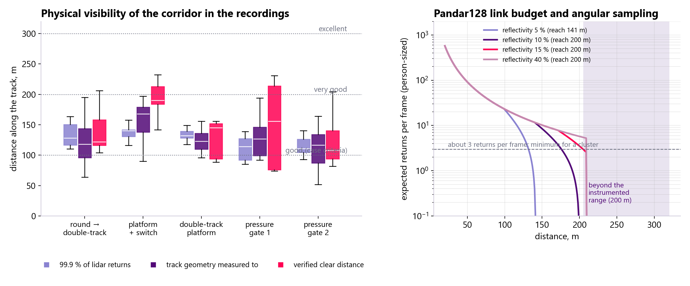

**1. The corridor is physically not visible that far in these recordings.** Per recording (every 5th frame):

| Recording | 99.9 % of returns closer than (median / max) | geometry measured to (median / max) | verified clear distance before the 210 m cap (median / max) |
|---|---|---|---|
| round → double-track | 128 / 164 m | 118 / 195 m | 122 / 206 m |
| platform + switch | 140 / 158 m | 168 / 197 m | 190 / 232 m |
| double-track platform | 132 / 196 m | 123 / 156 m | 145 / 156 m |
| pressure gate 1 | 114 / 139 m | 127 / 194 m | 156 / 231 m |
| pressure gate 2 | 111 / 140 m | 116 / 164 m | 108 / 204 m |

None of the sampled frames (every 25th frame of every recording) contains a single return beyond 250 m. Tunnel walls seen at grazing incidence stop
returning, and curves, platform structures and inter-track columns occlude the corridor.

**2. The sensor budget (Pandar128E3X user manual, Appendix A).** The instrumented time-of-flight range of the high-resolution channels is **200 m** — the recordings contain no return beyond 209 m — so nothing farther can be measured by this lidar, whatever its reflectivity; 300 m is out of reach for this sensor. Only channels 34–65 (elevation −2.9° … +1.0°) reach 200 m at 10 % reflectivity; the other high-resolution channels reach 140 m, the upper ones 100 m. From 80 m outwards the whole corridor (rail to 2 m above it) lies inside the 200 m channels for both lidar mountings. Within that, the reach of a 15 % target (a person) is ≈ 245 m on paper but capped at the instrumented 200 m, and at 0.1° × 0.125° sampling a person yields only ≈ 4–9 returns per frame at 180–200 m even with a clear line of sight.

**3. Detection funnel.** Ray-cast objects on the longest straight views (platform + switch, frames 289–311, geometry
measured to 186 m): with a warm detector a person is confirmed at 140–160 m; at 180 m the learned scorer rejected it,
at 200 m the two-tier rule reported CAUTION (beyond the measured range), at 220 m it was beyond the geometry horizon.
Placing the objects with a warm clean-frame reference geometry (instead of a 12-frame one) showed that on the true
corridor most 140–220 m positions receive **no return at all** — the earlier "visible" far objects had been placed off
the track, in open space. (The synthetic range curves in section 3 used the short warm-up for both placement and
detection, so their far bands carry this uncertainty.)

**4. Attempt: long-range scorer v2 (negative result).** New dataset with warm geometry, half of the objects at
120–245 m and candidates kept beyond the measured range (5 135 candidates, 596 positives, 134 beyond the measured
range); leave-one-recording-out; three decision policies (STOP within the measured range; plus a stricter score and
longer confirmation beyond it; plus sparse far clusters accumulated over frames):

| Features | AP | far AP (≥150 m) | best false STOP (budget 0.3 %) | recall 100–150 m | 150–200 m | 200–250 m |
|---|---|---|---|---|---|---|
| all | 0.832 | 0.413 | 0.61 % | 38 % | 6 % | 0 % (4 visible) |
| distance-invariant | 0.850 | 0.464 | 0.52 % | 41 % | 6 % | 0 % (4 visible) |

Of the objects deliberately placed at 150–245 m only 37 were visible at all (≥ 3 returns in some frame). Extending
STOP beyond the measured range or accumulating sparse far clusters added false alarms but no recall. The deployed v1
scorer was kept.

**Conclusion.** In these tunnels the achievable, honestly validated range is ≈ 120–160 m for a person, with the free path
verified up to the lidar's instrumented range (≈ 200 m) on straight sections. (Before this study the reported clear distance could reach 232 m through extrapolated geometry; it is now capped at 210 m because no return beyond that exists (`report_range_cap`; decisions are unchanged — capping the internal horizon instead would have shifted a scorer input). Reaching 200–300 m requires more photons and a view of the corridor, not
more processing: a long-range narrow-field lidar (1550 nm) or camera/radar fusion for the far field, and a stored track
map so that the envelope is known beyond the visible geometry. The software already reports `clear_distance`, the
distance up to which the path was actually verified, so the train can plan its speed against that value.

## 9. Ablation study

`tools/ablation.py` switches off one component at a time and reruns everything: every frame of the five obstacle-free
recordings (false STOP frames), the held-out real recording, and ray-cast person / 0.5 m box approaching from 80, 120
and 160 m (2 starts per recording; cases with fewer than 3 returns are excluded, leaving 5–10 cases per cell).
`tools/make_ablation_figures.py` draws the plots.

Caveats: variants that keep the learned scorer are evaluated on the recordings it was trained on, so their false-alarm
column is optimistic (the unbiased view of the learned stage is the leave-one-recording-out panel below); with 5–10
cases per range cell a difference of one or two cases is not significant; ray-cast placement used the same short-warm-up
reference geometry for all variants, so comparisons between variants are fair while absolute far-range values are
uncertain (section 8).

| Variant | false STOP frames | held-out STOP / in-gauge | held-out spurious | person 80 / 120 / 160 m | box 0.5 m 80 / 120 / 160 m |
|---|---|---|---|---|---|
| full system | 3 | 59 / 60 | 0 | 100 / 78 / 33 % | 100 / 71 / 0 % |
| − learned scorer (rules only) | 36 | 59 / 60 | 3 | 100 / 89 / 50 % | 100 / 29 / 20 % |
| − shell veto in the ML path | 12 | 59 / 60 | 0 | 100 / 78 / 33 % | 100 / 71 / 0 % |
| − shell-attachment test | 14 | 59 / 60 | 0 | 100 / 78 / 33 % | 100 / 71 / 0 % |
| − wall containment test | 3 | 59 / 60 | 0 | 100 / 78 / 33 % | 100 / 71 / 0 % |
| − gravity test | 3 | 59 / 60 | 0 | 100 / 78 / 33 % | 100 / 71 / 0 % |
| − shape (beam-extent) test | 6 | 59 / 60 | 0 | 100 / 78 / 33 % | 100 / 71 / 0 % |
| − M-of-N confirmation (1 of 1) | 5 | 59 / 60 | 0 | 100 / 78 / 33 % | 100 / 71 / 0 % |
| − temporal score smoothing | 5 | 59 / 60 | 0 | 100 / 78 / 50 % | 100 / 71 / 0 % |
| − 2σ uncertainty zones | 34 | 60 / 60 | 0 | 100 / 78 / 50 % | 100 / 71 / 0 % |
| − two-tier range rule | 3 | 59 / 60 | 0 | 100 / 78 / 67 % | 100 / 71 / 0 % |
| − temporal geometry prior | 17 | 60 / 61 | 5 | 90 / 67 / 0 % | 90 / 57 / 0 % |
| straight corridor (curvature suppressed) | 436 | 57 / 59 | 0 | 80 / 67 / 17 % | 80 / 57 / 0 % |

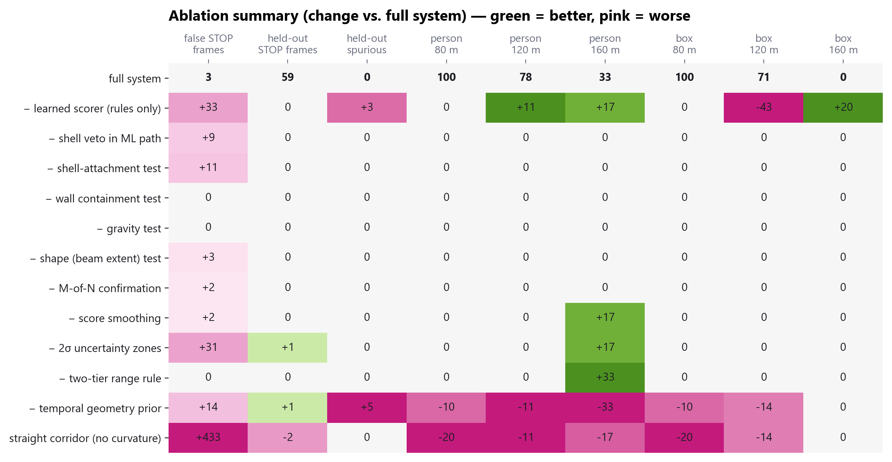

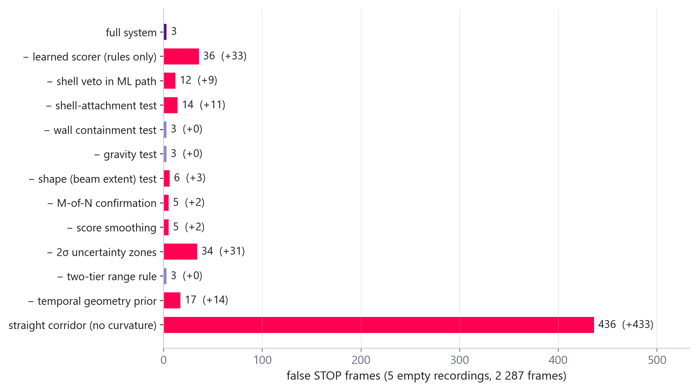

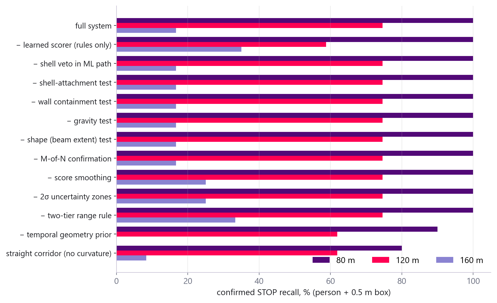

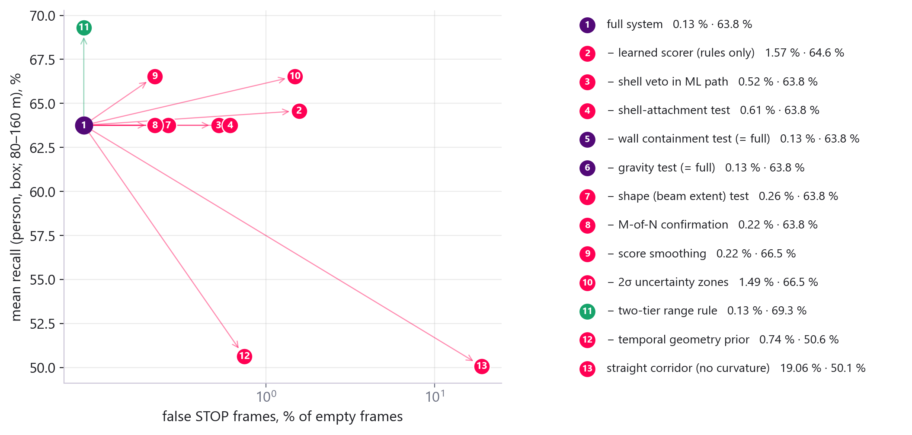

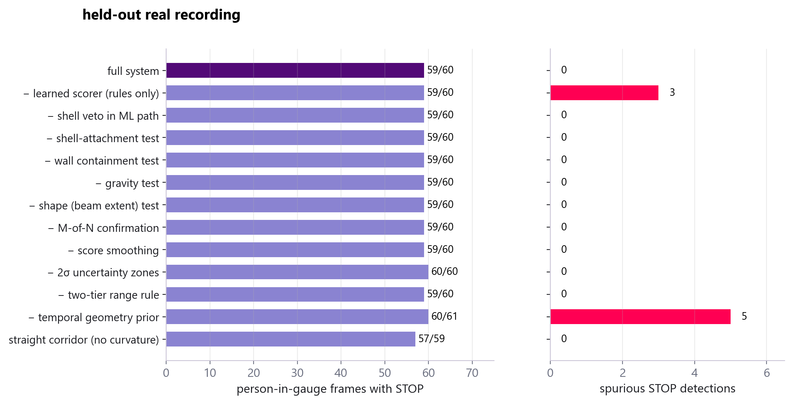

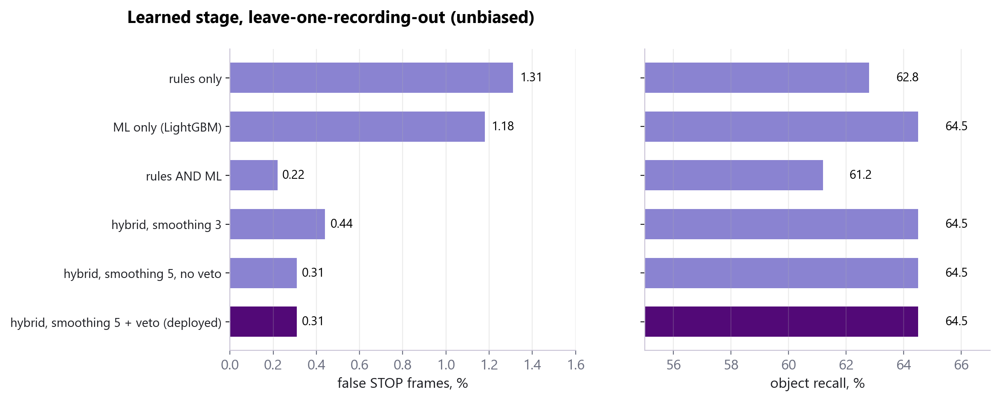

What the ablation shows:
* **Track curvature is the foundation.** Suppressing curvature (a straight corridor) raises false STOP frames from 3 to
  436 and loses 17–20 points of recall.
* **The learned scorer removes 33 of 36 rule false alarms** and all 3 spurious STOPs on the real recording, but the rules
  alone find a far person more often (89 / 50 % vs 78 / 33 % at 120 / 160 m): the v1 training set had only 17 positives
  beyond 150 m (section 8). The unbiased leave-one-recording-out comparison of the learned stage is in the last panel.
* **Uncertainty-aware (2σ) zones** prevent 31 false alarms; the **shell veto** 9 and the **shell-attachment test** 11.
* **Temporal fusion of the geometry** matters for range: without it recall at 160 m drops to 0 and 5 spurious STOPs appear.
* **Shape test, M-of-N confirmation and score smoothing** each prevent 2–3 false alarms.
* **Wall containment and gravity tests are redundant** once the learned scorer is present (no change on any metric);
  they remain the safety net of the rules-only mode (`scorer_model:=none`).
* **Two-tier range rule:** removing it doubled person recall at 160 m (2 more of 6 cases) with no extra false alarm
  in-sample; see the validation below before any change of the deployed default.

## 10. Pandar128 documentation: what was used

`tools/pandar_calibration_check.py`, `src/tunnel_guard/config/pandar128_channels.csv` (extracted from the user manual),
`tunnel_guard/core/pandar.py`.

| File | Finding | Use in the solution |
|---|---|---|
| Angle correction file | Matches the recorded lidar: elevation within 0.06° after a constant −0.064° mounting pitch, azimuth offsets within 0.08° (median 0.03°); channel 42 is the horizontal beam | validates the beam model fitted from the data; channel table in `core/pandar.py` |
| User manual, Appendix A | Instrumented range 200 m (high-res channels); 200 m at 10 % only for channels 34–65 (−2.9° … +1.0°), 140 m for the other high-res channels, 100 m upper channels, 25–100 m ground channels; high-res channels 26–90 have 0.125° spacing (−6.1° … +2.0°) | ray-cast evaluation now uses per-channel reach and the instrumented-range cap; unit tests check that the far corridor (80–200 m) is covered by the 200 m channels and by the 0.125° band assumed in the shape test and features |
| Firetime correction file + Appendix B.4 | Firing offsets inside a block ≤ 55 µs (unit ns) → < 1 mm at 10 m/s | no correction needed |
| Recordings' column timing | Forward sweep: 2 400 columns in 33 ms (moving recordings), 7 200 columns in 100 ms (obstacle recording) → the ±5° sector around the track axis is scanned in ≈ 3–4 ms, ≈ 3–4 cm of motion at 10 m/s | motion de-skew not needed for detection; would matter only for a map accumulated over the whole sweep |
| STEP model | Housing Ø 118 mm body, Ø 136 mm flange | no effect on detection (minimum range 1.5 m already clears the housing) |

## 11. New 20-minute recording (dataset2, never seen before)

> **Superseded by section 12.** The first-pass reading below ("consistent with staged obstacle scenarios") was wrong:
> the traversal test (12.2) proves that the train later drove through the location of every one of these alarms, i.e.
> all of them were false.  The table is kept as the record of the first, piece-wise evaluation.

`bags.zip` → `new_data.zst` → one rosbag2 recording, `/lidar_points`, 11 271 frames (1 200 s), split into 221 pieces of
5 s stored in random order.  Evaluated with the deployed hybrid detector directly from the archive, without extracting
it (`tools/stream_eval.py`, `tools/summarize_stream_eval.py`): each piece runs independently, its first 8 frames rebuild
the geometry and are not scored → **9 503 frames evaluated**.  No annotations were provided with this recording.

| Decision | Frames | Share |
|---|---|---|
| CLEAR | 5 724 | 60.2 % |
| CAUTION | 3 625 | 38.1 % |
| STOP | 154 | 1.6 % |

* STOP frames form **90 events** that cluster in about eight short episodes (timeline below), consistent with staged
  obstacle scenarios; snapshots of the first STOP frame of 80 events are in the evaluation output.
* Evidence classes: **10 strong** (≥ 20 points, ≥ 0.5 m high, ≥ 2 frames — e.g. a 1.5–1.7 m upright object approached
  from 61 m to 46 m, confidence up to 0.96), **28 medium**, **52 weak** (≤ 10 points — likely false alarms).
* Verified clear distance: median 154 m (10th percentile 88 m, 90th 210 m).
* Latency: median 138 ms, 95th percentile 288 ms — measured while another heavy job ran on the same laptop; on an idle
  machine the same frames run at ~70–90 ms.

**Precision, recall and accuracy cannot be computed for this recording yet: there is no ground truth.**  With the
positions of the staged obstacles (or a manual review of the 90 events) they follow directly from `frames.jsonl`.

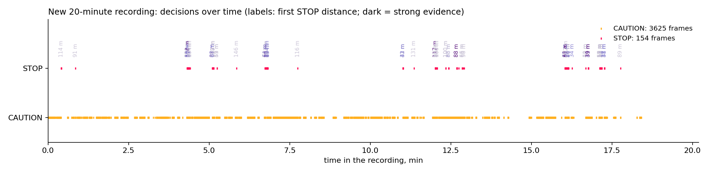

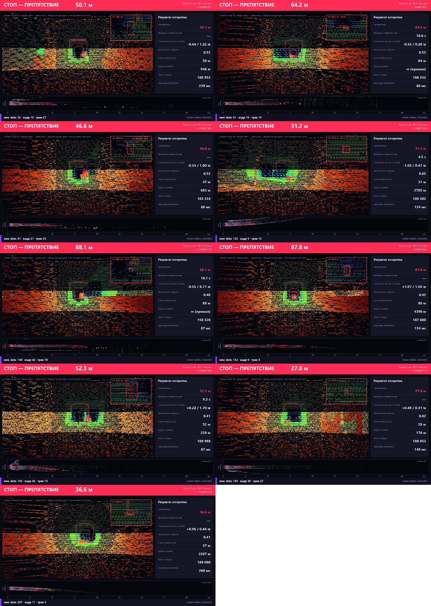

## 12. New line: self-labelling, domain-robust model, ego-motion test, sealed test

### 12.1 Datasets
| | Original data | Dataset 2 |
|---|---|---|
| Content | 6 short recordings, 5 tunnel types, 2 287 frames | one continuous 20-min drive, 11 271 frames, ~10 station stops |
| Train | mostly standing / slow | up to ~12 m/s, 13.0 km by lidar odometry |
| Obstacles | 5 recordings empty, 1 with people (held out) | none (no organiser labels; proven below) |
| Measures | detection (real people, ray-cast objects) and false alarms | false alarms on an unseen line; detection only via ray-cast objects |

### 12.2 Self-labelling by traversal ("the train is its own labeller")
1. **Lidar odometry.** Wall features (brackets, lamps, ring joints) outside the envelope form an along-track signature
   (0.1 m bins, detrended, Poisson-normalised); cross-correlation between consecutive frames gives the distance
   travelled (parabolic refinement, weak speed prior).  Checks: 0.000 m/frame on the stationary recording, 1.69 m/frame
   on a moving one, 13.0 km for the 20-min drive.
2. Every alarm is stored at its tunnel coordinate X = x_train + s.
3. When the train is ≥ 3 m past X, nothing solid can have been there → **proven false alarm**.  The label is physics,
   independent of the detector being evaluated; real obstacles never enter it (the train stops before them).

Result: all **91** STOP events of the previously deployed model on the drive (250 frames, 2.2 %, ≈ 7 / km) were driven
through → all false.  81 came from the learned path, 10 from the rules.
Code: `tools/run_drive.py` (continuous run, odometry), `tools/selflabel.py`, online variant `core/adapt.py`.

### 12.3 Domain-robust scorer: ½·LightGBM + ½·CatBoost (internal name v3)
Negatives: proven-false candidates of the drive (t < 900 s only) + the original recordings.  Positives: ray-cast people
and boxes in the real beams of both datasets (exact labels by construction).  Monotone LightGBM + CatBoost, threshold
from out-of-fold scores under the false-STOP budget (`tools/gen_dataset_v3.py`, `train_scorer_v3.py`,
`final_scorer_v3.py`).  The last 5 minutes of the drive (t ≥ 900 s, 2.8 km) are **sealed**: not used for training,
threshold choice or any tuning.

### 12.4 Ego-motion consistency test (physics, no training)
A solid object on the track closes in exactly as fast as the train advances: d(distance)/d(travel) = −1.  Most
remaining false alarms kept a constant distance (~25 m) while the train moved at 12 m/s — measurement artefacts that
travel with the train (geometry error of the rail plane, a rail seen ~0.3 m high).  A confirmed STOP track is
downgraded to CAUTION when its Theil–Sen slope against odometry travel is > −0.35 over ≥ 4 m of travel; young tracks
(artefacts fragment into short tracks) use the same test on their neighbourhood (was something at the same distance
ahead ≥ 5 m of travel ago, and nothing at distance + travel?).  A standing train never vetoes anything; a broken
odometry chain resets the evidence.  `core/detector.py: _carried_along, _pooled_carried`; unit tests
`test_ego_motion_*`.

### 12.5 Reproducibility fix found on the way
The far-field alignment subsampled points with one shared random generator, so every decision depended on how many
frames came before (the same model gave 30 or 6 sealed false-STOP frames depending on where the run started).  The
subsample is now seeded by the frame content (`geometry.sample_seed` + frame hash): the same frame always gives the same
result.  Because the subsample still matters, all numbers below are reported over **3 seeds** (mean, min…max).

### 12.6 Sealed test (t ≥ 900 s, 2.8 km, 2 397 frames; runs start at t = 870 s)
| Configuration | False STOP events per seed | Mean | Per km | Mean STOP frames |
|---|---|---|---|---|
| Previous deployed model (v1) | 39 / 28 / 20 | 29.0 | 10.3 | 49.3 (2.06 %) |
| ½·LightGBM + ½·CatBoost | 11 / 7 / 2 | 6.7 | 2.4 | 18.3 (0.76 %) |
| **½·LightGBM + ½·CatBoost + ego-motion test (final)** | **8 / 5 / 1** | **4.7** | **1.7** | **10.3 (0.43 %)** |

Median latency on an idle machine: 56–70 ms per frame (single thread).

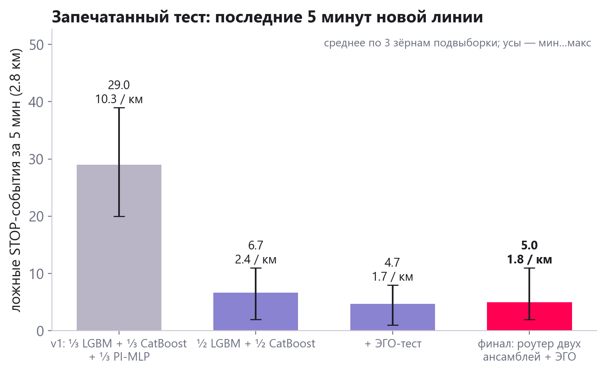

### 12.7 Original data: nothing lost
| Configuration (3 seeds) | False STOP frames (2 287) | Held-out people | person 80/120/160 m | box 0.5 m 80/120/160 m |
|---|---|---|---|---|
| v1 (before) | 3 | 59/60 | 100 / 78 / 33 % | 100 / 71 / 0 % |
| ½·LightGBM + ½·CatBoost | 3 / 3 / 0 | 58/60 | 100 / 78 / 33 % | 90 / 71 / 0 % |
| ½·LightGBM + ½·CatBoost + ego-motion | 3 / 3 / 0 | 58/60 | 100 / 78 / 33 % | 90 / 71 / 0 % |

The ego-motion test changed **no** decision on the original data (every seed identical), i.e. it costs no recall.
v1 row: previous random-subsample geometry.  Ray-cast cells have 6–10 trials each (≈ ±15 %).

### 12.8 Tried and rejected
* **STOP debounce** beyond 30 m (2 consecutive, or 2 of the last 3 STOP-eligible frames): sealed events 4.7 → 3.7, but
  box recall at 120 m 71 → 43–57 %, person at 160 m 33 → 17 %, held-out 58 → 57.  Safety first: off
  (`stop_debounce_frames = 1`).
* **Online adaptive threshold** (`core/adapt.py`): no measurable effect on the sealed block (30 → 30 frames) — the
  proven-clutter quantile stays below the trained threshold on this line.  Kept, disabled by default.
* **Near-field burst at t ≈ 1022 s (seed 0):** a rail-like artefact appears suddenly at ~24 m with no earlier trace.
  Indistinguishable, by motion, from a person stepping onto the track, so it is not vetoed (known limitation;
  a vertical/cant transition of the track — future work: rail-continuity test).

### 12.9 Ensemble weights: how they were chosen
Final model logit = w₁·logit(LightGBM) + w₂·logit(CatBoost), w₂ = 1 − w₁.  Protocol (`tools/weight_sweep.py`): the same
8 leave-one-group-out folds (5 original tunnels + 3 blocks of the new drive, sealed block excluded); for each w₁ in
0, 0.1, …, 1 the threshold of every fold is chosen on its training groups only (false-STOP budget 0.3 %), then false STOP
frames and object recall are measured on the held-out group.

| w₁ (LightGBM) | 0.0 | 0.1 | 0.2 | 0.3 | 0.4 | **0.5** | 0.6 | 0.7 | 0.8 | 0.9 | 1.0 |
|---|---|---|---|---|---|---|---|---|---|---|---|
| false STOP frames / 11 159 | 35 | 34 | 37 | 36 | 36 | **35** | 34 | 36 | 37 | 36 | 37 |
| object recall, % | 67.4 | 67.6 | 67.6 | 67.4 | 67.4 | **67.3** | 67.4 | 67.4 | 67.3 | 67.4 | 67.6 |

The optimum is flat (differences are within one or two frames), so the weights were not tuned: equal weights were fixed
in advance (lowest variance, nothing fitted to the validation folds).  The previous model v1 likewise used equal thirds
for LightGBM, CatBoost and the physics-informed MLP; the MLP was dropped because it added nothing out of fold.

### 12.10 How STOP, CAUTION and CLEAR are decided (per frame)
* **STOP**: at least one object that (1) is confirmed by the tracker (≥ 3 detections in the last 5 frames), (2) has ≥ 2
  points inside the envelope shrunk by 2σ of the track-geometry uncertainty, within the range measured in this frame,
  (3) below 30 m passes the physics tests; beyond 30 m has a 5-frame-smoothed ensemble score ≥ 0.425 and is not attached
  to the tunnel shell, (4) passes the ego-motion test (it closes in at the train's speed).
* **CAUTION**: no STOP object, but a confirmed object touches the envelope boundary (within the 2σ margin), lies beyond
  the measured geometry, was vetoed by the scorer or the ego-motion test, or an in-envelope track is not yet confirmed.
* **CLEAR**: nothing of the above; the output still reports how far the path is verified clear (visibility horizon and
  measured geometry, capped at the 200 m instrumented range of the Pandar128).

## 13. Dataset 3: the organisers' synthetic obstacles, and the final model

### 13.1 The data
One bag (`cloud_with_fake_obj`, `/lidar_points`, 1 510 frames, 16-byte points x, y, z, intensity, unorganised clouds):
a real tunnel recording with ten synthetic objects ~100 m apart (2×2 m and 0.3 m cubes in the centre and at the edge
of the gauge, a 0.3 m cube on a rail, objects outside and above the gauge, a 2×0.2 m bar on the rails, a 0.05 m rod
hanging from the roof).  Our copy of the archive is corrupted after 438 frames (zstd checksum error, single frame), so
only obstacles 1-3 and 9 are in the readable part (`tools/peek_ds3.py`, `tools/stream_eval_ds3.py`).

### 13.2 What the data taught us
* **The objects float.** The generator places them on a flat, straight plane in the lidar frame at rail-head level,
  while the real track descends ~1.5 m over 100 m: the "2×2 m box on the track" is 1.4 m above the real rails at 98 m.
  Our geometry was right (floor returns confirm it); our tests assumed hazards stand on the floor.
* **The objects stall and jump** (a frame late, then catching up) and frames arrive with 0.1-0.8 s gaps.

### 13.3 Changes (all general, none specific to this bag)
| Change | Why |
|---|---|
| New tracks start with the train's closing speed from lidar odometry; the gate tolerates one frame of the train's travel | a static obstacle closes exactly at train speed; recorders drop, repeat and re-time frames |
| Odometry bridges frame gaps up to 1 s (search range = 25 m/s × dt) | it froze at 381 m on this bag; now tracks the whole run |
| Bit-identical repeated clouds re-issue the last decision | a repeat carries no new information |
| Shell attachment needs continuity (roof starts within 3 beam spacings above the cluster top) | a floating object below the roof is not infrastructure |
| Shell veto only for floor-reaching slices (h_min < 0.8 m) | real shell-attached negatives are floor-to-roof wall slices; hanging objects are hazards |
| Scorer retrained on the full hazard space (`synth.random_hazard`: floor objects, floating cubes 0.25-2 m lifted 0.3-1.8 m, bars across the rails, rods 3-12 cm hanging from the roof), ray-cast into datasets 1 and 2 only | the original positives were floor-standing only |
| **Router (mixture of experts by physical state):** floor-supported candidates → ½·LGBM + ½·CatBoost (v3), candidates with bottom ≥ 0.5 m → hazard-space ½·LGBM + ½·CatBoost (v4); each against its own out-of-fold threshold | v4 is best on floating objects, v3 on far floor objects |

A labelling bug was found and fixed on the way: the drive-data generator matched lateral offsets in a mirrored frame
(3 664 correct positives instead of 1 783).  Two monotone constraints (shell attachment, floor support) that encoded
the floor-standing assumption were removed for v4.

### 13.4 Dataset 3, readable part (first STOP distance, share of frames with STOP after the first)
| Obstacle | Before | Detector fixes, v3 | Detector fixes, v4 | **Final: router** |
|---|---|---|---|---|
| 2×2 m, centre | 48 m, 71 % | 48 m, 91 % | 98 m, 96 % | **98 m, 94 %** |
| 0.3 m, centre | 15 m, 33 % | 20 m, 89 % | 20 m, 89 % | **20 m, 89 %** |
| 0.3 m on a rail | 18 m, 25 % | 23 m, 82 % | 23 m, 82 % | **23 m, 82 %** |
| 2×0.2 m bar on the rails | 30 m, 27 % | 60 m, 43 % | 44 m, 53 % | **60 m, 52 %** |

### 13.5 Full ten-object replica (`tools/replica_ds3.py`)
The organisers' sequence rebuilt in the real beams of a moving train on the new line (50-60 km/h), placed as their
generator does (flat and straight in the lidar frame).  Evaluation only.

| Object | Expected | v3 | **Router** |
|---|---|---|---|
| 1 · 2×2 m centre | STOP | 32 m | **116 m** |
| 2 · 0.3 m centre | STOP | 58 m | **99 m** |
| 3 · 0.3 m on a rail | STOP | 8 m | 8 m |
| 4 · 0.3 m at the gauge edge | STOP | — | — |
| 5 · 0.3 m outside, close | no STOP | ✓ | ✓ |
| 6 · 2×2 m at the edge, inside | STOP | 29 m | 29 m |
| 7 · 2×2 m outside | no STOP | ✓ | ✓ |
| 8 · 2×2 m above the gauge | no STOP | ✓ | one STOP frame at 164 m |
| 9 · 2×0.2 m bar on the rails | STOP | 45 m | 45 m |
| 10 · 0.05 m rod from the roof | STOP | 30 m | 30 m |

Caveats: on this stretch the track climbs, so flat-placed objects near rail level sink below the track bed and get no
returns until close (objects 3, 9); object 4 sits exactly on our envelope boundary (1.25 m at that height) and its
status depends on the organisers' gauge definition, which is not published.  The bar (0.2 m) is scored 0.83-0.87 by the
model but stays below the confident envelope floor (0.15 m + 2σ ≈ 0.23 m), a deliberate margin against rail-plane
errors, where earlier real false alarms lived.

### 13.6 False alarms and recall of the final model
| | v3 | v4 | **Router (final)** |
|---|---|---|---|
| Dataset 1: false STOP frames / 2 287 | 3 | 0 | **0** |
| Dataset 1: held-out real people, STOP frames / 60 | 58 | 56 | **58** |
| Dataset 1: person 80 / 120 / 160 m | 100 / 78 / 33 % | 100 / 67 / 0 % | **100 / 78 / 33 %** |
| Dataset 2 sealed block: false STOP events per seed (3 seeds, 2.8 km) | 9 / 2 / 2 | 9 / 0 / 2 | 11 / 2 / 2 |
| Dataset 2 sealed block: false STOP frames (sum of 3 seeds) | 26 | 17 | 23 |

The router's sealed events are the union of one event from each expert's own domain (a floating blip at 108 m, a floor
object at 42 m on seed 0); the differences between the three models are within the seed-to-seed spread.

